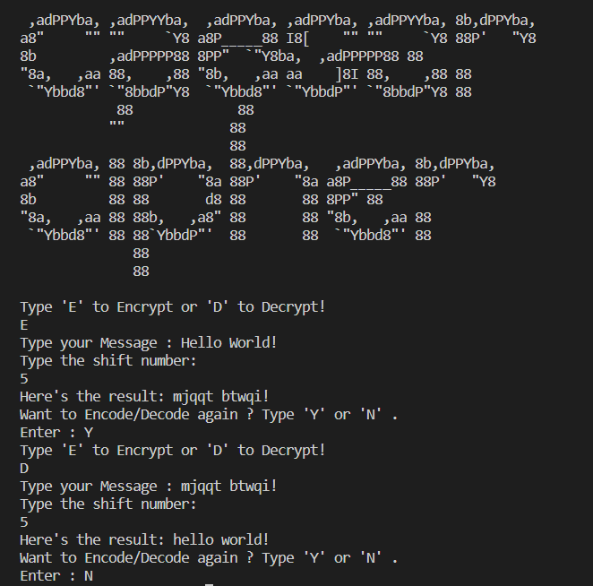

# Caesar Cipher Project

A project based on Caesar Cipher Technique used for
encryption/decryption of text.

## Project Working

- A user needs to choose between encrypt/decrypt option.
- The user will then enter the message they want to encrypt/decrypt.
- The user will be asked to enter a shift number.
- The user can only view the encrypted/decrypted message
if they have access to the shift number.
- The user now has access to the message.

## Project Demo

## Contributing

Contributions are always welcome! :)

