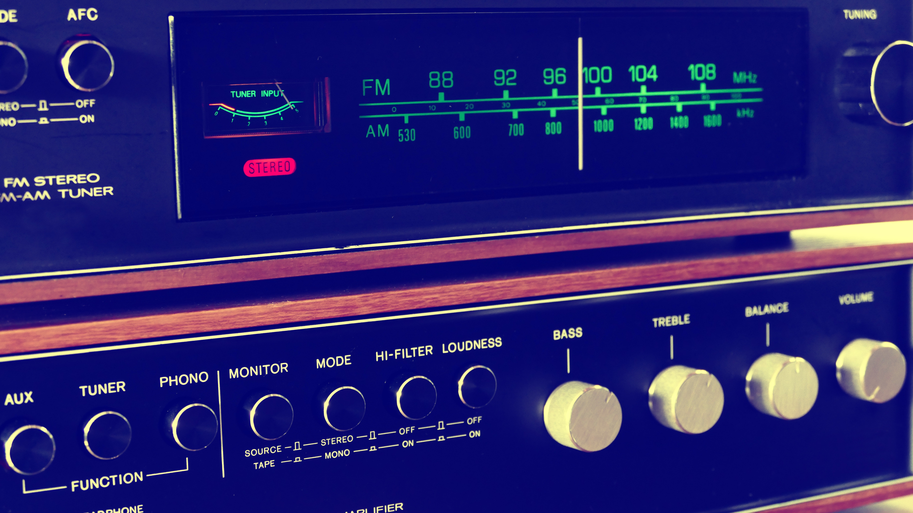

**We are choosing ADA Boost classifier, so let's make it more accurate using the hyperparameters. 🔏**



```python
#Importing essential libraries
import pandas as pd
import joblib as jb
from sklearn import ensemble, pipeline, compose, model_selection

# Read ,split the data and import the cleaning pipeline
df = pd.read_csv('spaceTrain.csv')
# removing useless columns
features = df.drop(['PassengerId','Cabin','Name','Transported'],axis = 1)
target = df.Transported
# Names of Numerical and Categorical features
numerical_features = [feat for feat in features if features[feat].dtypes !='O']
categorical_features = [feat for feat in features if feat not in numerical_features]

# Split your dataset into training and testing dataset
x_train,x_test,y_train,y_test = model_selection.train_test_split(features,target,test_size = 0.2,stratify=target)

# Importing pipeline
cleanIt = jb.load('clean.joblib')
```
## Hyperparameters 📑 of ADA Boost classifier - 

 |Hyperparameters|Description|
 |---------------|-----------|
 |base_estimator|The base estimator from which the boosted ensemble is built.|
 |n_estimators|The maximum number of estimators at which boosting is terminated. I|
 |learning_rate|Weight applied to each classifier at each boosting iteration. A higher learning rate increases the contribution of each classifier. |
 |algorithm|Two algorithms based on which boosting works|
 |random_state|Controls the random seed given at each base_estimator at each boosting iteration.|

 > Now let's create a list of parameters and fit it in grid search module

```python
parameters = {
    'n_estimators': [2, 3, 4, 5, 6, 7, 8, 9, 10, 11, 12, 20],
    'learning_rate': [(0.97 + x / 100) for x in range(0, 8)],
    'algorithm': ['SAMME', 'SAMME.R']
}

clf = ensemble.AdaBoostClassifier()

grid = model_selection.GridSearchCV(clf,parameters,cv=5,verbose=0)
grid.fit(cleanIt.fit_transform(x_train),y_train)
```
> To find the best estimator, best score and best parameters

```python
grid.best_estimator_,grid.best_params_,grid.best_score_
```
> Create the final model with best parameters

```python
model = ensemble.AdaBoostClassifier(n_estimators=20,learning_rate=1.04,algorithm='SAMME.R')
```
> Final pipeline

```python
Final_pipeline = pipeline.make_pipeline(cleanIt,model)
Final_pipeline.fit(x_train,y_train)
y_pred = Final_pipeline.predict(x_test)
```
> Check the accuracies

```python
accuracy = metrics.accuracy_score(y_test,y_pred)
roc_auc = metrics.roc_auc_score(y_test,y_pred)
f1score = metrics.f1_score(y_test,y_pred)
```

> ### With this, we've completed our classification algorithm 🎈

**View on [Github](https://github.com/Hg03/Classification)**