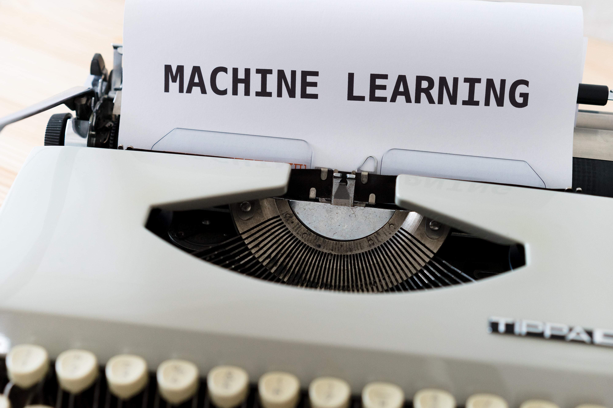

## What actually machine learning is ??

Let's take some example for understand the concept of machine learning.

**Example no. 1 -** Assume you are preparing for competitive exam (or maybe goverment), and you exactly dont know about the question and its patterns. You can prepare for exam using 📚,coaching or online resource like 🌐. Therefore what you're really trying to train your mind through studying to know all types of pattern that can occurs. Finally in exam , you'll see the question and match the patterns that your mind have captured with it then solve it. **Am i right ???**

**Example no. 2 -** Assume you are the owner of renowned 🍦 company and going through the downfall of your company. So you'll try to analyze what's going on wrong ??

* Is our high range of flavours confusing customers and eventually they chooses wrong taste.
* Are they bored with our flavours.
* Is our price of ice creams are high.
* It can also depend on behavior of our employers to customers.
* and many more.

Basically you have all this data through cctv cameras, survey forms etc and you'll find some relations between customers satisfaction and your services. **Am i right ??**

### That's what ML is for !! 👍
Machine learning is a model or in leymann kinda box, which takes input data and gives the result which we really want by finding the relation between input data. Look at some more examples [here](https://www.salesforce.com/eu/blog/2020/06/real-world-examples-of-machine-learning.html).
  
