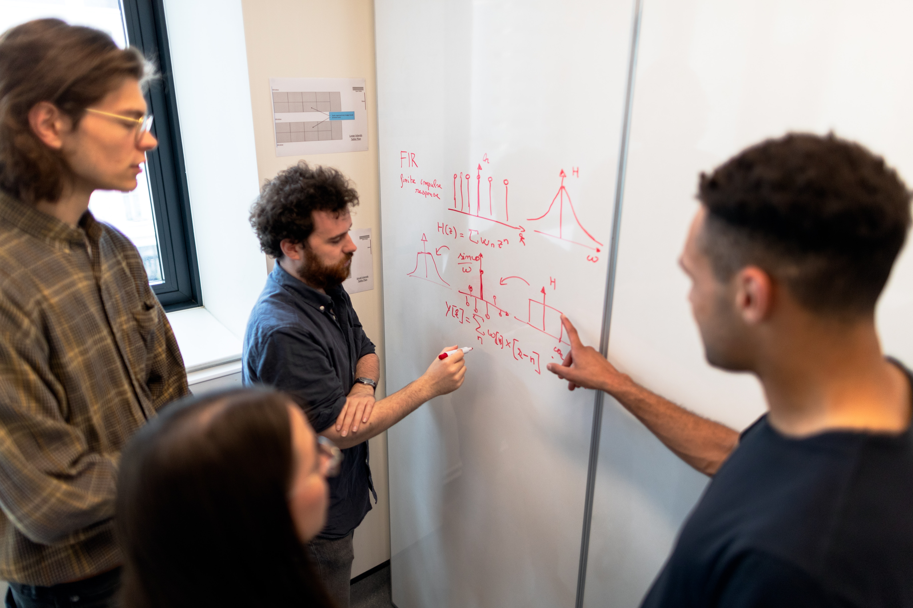

## Workflow for creating machine learning model 🏗️

To create any machine learning models, we follow some core steps to reach our goal. As we've previously workflow in [introduction section](docs/../index.md). Here we'll discuss in depth.

### Step 1️⃣

**Define the problem** - When any problem comes to you (like identify / predict this, that whatever). 

Just think !!!

* What we really have to find/predict.
* Is your problem classification or regression or is it a unsupervised.
* Is your predictions gonna benefits your company.
* What data or feature you require to creating the model.

### Step 2️⃣

**Data Collection** - After defining the problem statement, sometimes should be given to you if you are blessed by GOD otherwise you have to scrap the data from website. After collecting, 

Just think 🤔!!! 

* Does that data defines or suits your problem efficiently or more independent variables are required.

There are many methods or we can say python libraries used to collect the data from website (also known as web scraping) like
  
* [Beautiful Soup](https://www.crummy.com/software/BeautifulSoup/bs4/doc/)
* [Requests](https://pypi.org/project/requests/)
* [Selenium](https://selenium-python.readthedocs.io/)
* [Urllib](https://docs.python.org/3/library/urllib.html)
* and many more.......

### Step 3️⃣

**Data Exploration** 💥 - After collecting data successfully, you have to find out what that data is telling to you like

* How much rows or columns it has.
* What are the counts of values in a columns, is it columns biased (means only one type of value is filled in whole column).
* Are there any missing values and how you deal with it.
* Are there any outliers(some data points which are far different from all points like [1,2,3,10,100], here 100 is outlier).
* Is the distribution of feature is normal(using graph, we check is distribution is gaussian or not) or kinda biased(not following any pattern).
* As our machine learning model doesn't accept categorical/textual data, how you can convert it into numerical form.
* Check relationship between each indepenent feature with independent feature and also independent feature with dependent feature (There should be no relation between independent and independent otherwise non-collinearity occurs and there should be some relation between independent and dependent).
* There is lot of more steps to clean.

### Step 4️⃣

**Splitting** 🛣️ - After exploration of dataset, just split your data in part before doing any futher steps. You can split your data in many parts such as -

* Train-Test split - In this ,keep 80%(generally) of data into training of your model and test your model in remaining 20% of your data.
* Cross validation - In this, divide your data in more than 2 parts(usually) like assume 5. So therefore keep the first 4 parts in training and last one in testing, then again train with different 4 parts and anyone part in testing. There are many cross validation techniques such as **leave-one-out**, **k-fold**, **stratified-k-fold**, **Hold-out** and **Repeated-k-fold**.

**Note - After splitting, whatever cleaning, modellin we have to done, do it with training data and keep testing data aside until you want to test your model .**

### Step 5️⃣

**Data Cleaning** 🧹 - After splitting the dataset(or you can call it data), you have to get your hands dirty in cleaning the data because more cleaner the data you feed to your model, more accurate your model becomes.

**Steps involved in cleaning are :-**

* Imputing the missing(null) values by removing them or replacing them with its column's mean,median or mode depends on situation. (There are also multivariate imputing concept, we'll discuss it).
* Encode the categorical features means convert categorical features in numerical features. There are many to encode the categorical like **ordinal encoding**, **one hot encoding**, **target encoding**.
* There may be outliers in the data, so check it using boxplot graph. If there are outliers,we should remove it if we've have lots of data otherwise we shouldn't. There are many methods to remove or replace the outlier's values such as **trimming**, **capping**, **inter-quartile-range** and **discretization**.
* If it is a regression problem or any neural network problem, we also have to make our standardized or normalized (all values should lie between particular range). We can do this using standardization or normalization.[Feature Scaling]
* Standardization or normalization process doesn't required in classification task.
* Making the distribution gaussian by using log ,exponential, square or else-other.
* Remove the feature which are related with independent feature and not related with target. We can identify this using correlation map and can remove feature using some methods such as **pearson correlation coefficient**,**anova test**,**chi square test**,**selectKbest**,**selectpercentil** etc.
* Most Most Most important step is to create a pipeline for data cleaning, so that you don't to do same and same task by your own. Pipeline can do its work automatically.

**Don't hesistate to take time to explore and clean data. Almost 80% of work in creating machine learning model is the feature engineering[all parts that we discussed above] .**

### Step 6️⃣

**Model Building** 🏚️ - After cleaning the data and creating its pipeline, now we are good to go with model building. Model building consist of following steps such as -

* Different types of algorithm are there in python libraries, which helps us to create ml models.

List of few of them -
 
|Regression & Classification Models|
|----------------------------------|
| Linear Regression (regression)   |
|Stochastic Gradient Descent (For both,but mainly regression)|
|Logistic Regression (classification)|
|Support Vector Machine (For both)|
|Decision Tree (For both)|
|Random Forest (For both)|
|Naive Bayes(For classification)|
|ADABoost and Gradient Boost (For classification)|
|KNearest Neighbor (For both)|

 **Never ending list.........**

To know more about this models, you can visit [sklearn](https://scikit-learn.org/stable/supervised_learning.html).

* Model creation is as easy as creating instance using function. But we have to make our model accurate so for this **Step 7️⃣** appears.
* Model selection is really crucial, and you also have to try each model based on classification or regression.

### Step 7️⃣

**Tuning and tweaking** - To create highly accurate model, we want to choose the correct model from lots of options and that models also contains parameters (functional parameters), so we have to select the right parameters for our model and this process is called **Hyperparameter tuning with model selection**.

**If you are confused here, don't worry we'll see a code example in furhter pages**.

### Step 8️⃣

**Evaluation** 📒 - After creating model, we are choosing hyperparameter right ??. So how we can confirm that these are right parameters, by checking accuracy. **Accuracy** is a method in which compare predicted values with real target values. ''More our values are matching with true values, more accurate our model is''.

* To evaluate, we use metrics (its just like methods to find accuracy), for classification and regression we use different metrics such as 
|Regression|Classification|
|----------|--------------|
|Mean Absolute Error|Accuracy|
|Mean Squared Error|Precision|
|Root Mean Squared Error|F1 score|
|Root Mean Logarithmic Error|ROC curve|
|Mean Percentage Error|AUC|
|Mean Absolute Percentage Error|Log loss|
|R square|Average precision|
||Mean Average Precision|
||Confusion Matrix|

**To know more about evaluation metrics, check [sklearn](https://scikit-learn.org/stable/modules/model_evaluation.html) here**.

**After creating the model for high accuracy, don't forget to put it in pipeline**

### Step 9️⃣

**Test on real world** - After model building, test your model on testing set(unknown data). Feed your data to pipeline and pipeline do all the feature engineering and model testing by its own.

**Key points to remember** 🖊️

* Machine learning is an iterative process, more we see data, more our model will learn and more accurate it will become.

  

